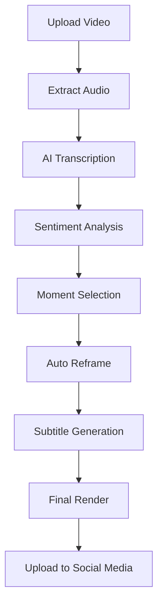

<div align="center">

# 🎬 Media Cuts Studio

> **Plataforma de IA que transforma automaticamente vídeos longos em cortes virais otimizados para redes sociais**

[](https://python.org/)
[](https://www.typescriptlang.org/)
[](https://reactjs.org/)
[](https://flask.palletsprojects.com/)
[](https://docker.com/)
[](https://openai.com/)


</div>

---

## 🚀 **Visão Geral**

**Media Cuts Studio** é uma solução completa de **Inteligência Artificial** que automatiza todo o processo de criação de conteúdo viral para redes sociais. O sistema utiliza modelos avançados de IA para identificar os melhores momentos de vídeos longos, criar legendas dinâmicas, aplicar reframes inteligentes e agendar publicações automaticamente.

### 🎯 **Problema Resolvido**
Creators gastam **80% do tempo** em edição repetitiva. Nossa IA elimina esse gargalo, transformando horas de trabalho manual em **minutos de automação inteligente**.

---

## 🧠 **Tecnologias de IA Implementadas**

### **🎯 IA de Seleção de Momentos Virais**
- **OpenAI GPT-4 Agents SDK** - Análise semântica avançada
- Processamento de **horas de conteúdo** → **10+ trechos virais**
- **Análise de sentimento** e potencial de engajamento
- **Scores de viralização** com justificativas detalhadas

### **🎙️ IA de Transcrição Multilíngue**
- **OpenAI Whisper** + **HuggingFace Models**
- Suporte a **+50 idiomas**
- Geração de legendas **.srt** e **.ass** com sincronização perfeita
- **RAG (Retrieval-Augmented Generation)** para contexto

### **🔄 IA de Auto Reframe Inteligente**
- **YOLOv11** com **Fine-tuning** personalizado
- Detecção facial e corporal em tempo real
- **Recorte automático** para formato vertical (9:16)
- Alinhamento inteligente para diferentes tipos de conteúdo

---

## 🏗️ **Arquitetura Técnica**

### **Backend - Microserviços Escaláveis**
```
┌─────────────────┬─────────────────┬─────────────────┐
│   API Gateway   │   AI Services   │   File Manager  │
│    (Flask)      │    (Celery)     │    (Nginx)      │
└─────────────────┴─────────────────┴─────────────────┘
         │                 │                 │
┌─────────────────┬─────────────────┬─────────────────┐
│   Scheduler     │   Upload API    │   Webhook API   │
│  (APScheduler)  │   (FastAPI)     │   (Real-time)   │
└─────────────────┴─────────────────┴─────────────────┘
```

#### **Stack Principal**
- **Python** (Flask, FastAPI, Django)
- **Celery** + **Redis** - Processamento assíncrono
- **FFmpeg** com aceleração **GPU** (70% mais rápido)
- **Docker** + **Docker Compose** - Containerização
- **PostgreSQL** + **MongoDB** - Dados estruturados e logs

### **Frontend - SPA Moderna**
- **React** + **TypeScript** + **Vite**
- **Tailwind CSS** - Design system responsivo
- **Real-time WebSockets** - Updates instantâneos
- **Recharts** - Dashboards e analytics
- **PWA Ready** - Experiência mobile nativa

### **DevOps & Infraestrutura**
- **CI/CD** com **GitHub Actions**
- **Docker in Docker** para builds dinâmicos
- **Nginx** com **SSL/TLS** automático
- **Monitoring** com **Uptime APIs** (6-12h intervals)

---

## ⚡ **Features Principais**

### **🤖 Inteligência Artificial**
- [x] **Seleção automática** de melhores momentos
- [x] **Análise de sentimento** e engajamento
- [x] **Transcrição multilíngue** (50+ idiomas)
- [x] **Auto-reframe** para formatos verticais
- [x] **Sugestões de hashtags** virais
- [x] **Scores de viralização** com justificativas

### **🎬 Processamento de Vídeo**
- [x] **Resolução 4K** (Ultra HD) suportada
- [x] **GPU acceleration** - 70% mais rápido
- [x] **Batch processing** - até 30 arquivos simultâneos
- [x] **Legendas dinâmicas** com múltiplos temas
- [x] **Preview em tempo real** durante processamento

### **📊 Gestão & Analytics**
- [x] **Dashboard completo** com métricas em tempo real
- [x] **Sistema de projetos** com controle de versão
- [x] **Agendamento automático** (YouTube, TikTok)
- [x] **Análise de engajamento** pós-publicação
- [x] **Logs detalhados** de todas operações

### **🔗 Integrações**
- [x] **YouTube Data API** - Upload e agendamento
- [x] **WhatsApp Business** (Evolution API)
- [x] **Discord** + **Telegram** - Notificações
- [x] **Firebase Realtime** - Sincronização
- [x] **OpenAI API** - Modelos GPT-4

---

## 📈 **Planos e Escalabilidade**

| **Feature** | **Startup ($0)** | **Creator ($8)** | **Studio ($100)** |
|-------------|------------------|------------------|-------------------|
| **Resolução** | 1080p | 2K | 4K |
| **Vídeos/mês** | 60 | 90 | Ilimitado |
| **Projetos simultâneos** | 1 | 2 | 2-5 |
| **IA Model** | GPT-4-nano | GPT-4-mini | GPT-4-mini |
| **Servidor** | Compartilhado | Compartilhado | **VPS Dedicado** |
| **Early Access** | ❌ | ❌ | ✅ |


## 📊 **Arquitetura de Dados**

### **Pipeline de Processamento**


### **Modelos de IA Utilizados**
- **OpenAI GPT-4** - Análise de conteúdo e seleção
- **Whisper** - Transcrição de áudio
- **YOLOv11** - Detecção de faces
- **HuggingFace Transformers** - NLP e classificação

---

## 🔧 **APIs Principais**
- em breve

---

## 🎯 **Casos de Uso**

### **Content Creators**
- Podcasters que querem clips automáticos
- Streamers com highlights de gameplay
- Educadores criando micro-conteúdos

### **Agências de Marketing**
- Campanhas multi-plataforma automatizadas
- Reaproveitamento de conteúdo existente
- Escalabilidade sem aumento de equipe

### **Empresas**
- Treinamentos corporativos em pílulas
- Webinars transformados em social media
- Onboarding automatizado

---

## 🚀 **Próximos Desenvolvimentos**

### **Q1 2025**
- [ ] **Live Streaming AI** - Cortes em tempo real
- [ ] **TikTok Auto-Scheduler** 
- [ ] **Advanced Analytics** com ML
- [ ] **Mobile App** (React Native)

### **Q2 2025**
- [ ] **Voice Cloning** para dublagem
- [ ] **Brand Safety AI** - Detecção de conteúdo
- [ ] **Multi-language UI**
- [ ] **Enterprise SSO**

---

## 📞 **Suporte & Comunidade**

<div align="center">

[](https://chat.whatsapp.com/HJQc4fGo6QiJwOqm53GhqB)
[](https://discord.gg/b86dhb8Qga)
[](https://t.me/+rqGM2C9IxKk3Y2Ix)

**📧 Contato:** mediacutsstudio@gmail.com  
**🌐 Website:** [media-cuts.studio](https://mediacutsstudio.com)  
**📚 Docs (em breve):** [docs.mediacutsstudio.com](https://docs.mediacutsstudio.com)

</div>

---

## 📄 **Licença**

Este projeto está sob a licença **MIT**. Veja o arquivo [LICENSE](LICENSE) para mais detalhes.

---

<div align="center">

### **🎬 Transforme suas horas de conteúdo em minutos de sucesso**

**Feito com ❤️ para a comunidade de criadores de conteúdo**

[](https://github.com/ualers2/media-cuts-studio)
[](https://github.com/ualers2)

</div>